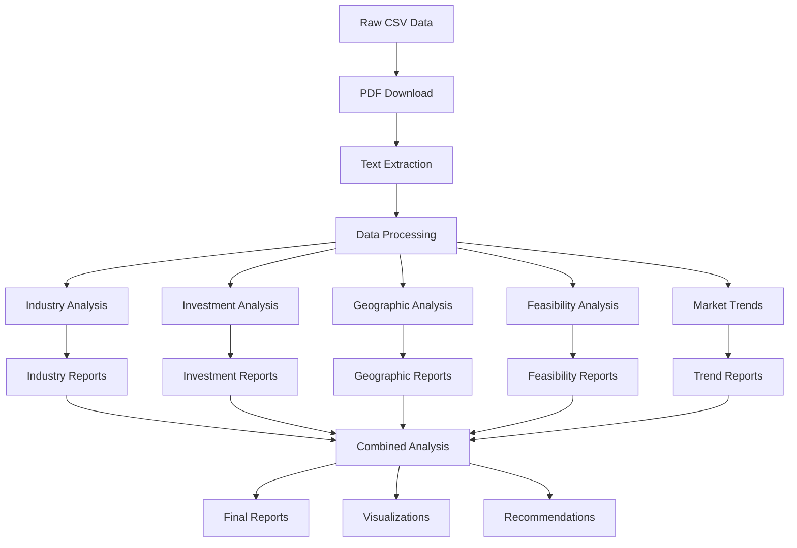

# PMEGP Project Structure Visualization

## 🏗️ Directory Structure

```
pmegpeportal-programme/
├── 📁 data/                          # Data Management Hub
│   ├── 📁 source/                    # Raw Data Storage
│   │   ├── projects_output_clean.csv # Master project database
│   │   └── 📁 pdfs/                  # Downloaded project PDFs
│   │
│   └── 📁 solutions/                 # Solution-Based Analysis
│       ├── 📄 README.md              # Solutions overview
│       ├── 📁 industry-analysis/     # Sector-wise analysis
│       │   ├── 📁 processed-reports/ # Industry data analysis
│       │   ├── 📁 insights/          # Key findings
│       │   └── 📁 visualizations/    # Charts & graphs
│       │
│       ├── 📁 investment-range-analysis/
│       │   ├── 📁 processed-reports/
│       │   ├── 📁 insights/
│       │   └── 📁 visualizations/
│       │
│       ├── 📁 geographic-distribution/
│       │   ├── 📁 processed-reports/
│       │   ├── 📁 insights/
│       │   └── 📁 visualizations/
│       │
│       ├── 📁 feasibility-assessment/
│       │   ├── 📁 processed-reports/
│       │   ├── 📁 insights/
│       │   └── 📁 visualizations/
│       │
│       └── 📁 market-trends/
│           ├── 📁 processed-reports/
│           ├── 📁 insights/
│           └── 📁 visualizations/
│
├── 📁 scripts/                       # Automation & Tools
│   ├── 📁 automation/               # PDF download & processing
│   │   ├── 📄 pdf_downloader.py    # Automated PDF downloader
│   │   ├── 📄 pdf_extractor.py     # Text extraction from PDFs
│   │   └── 📄 data_cleaner.py      # Data preprocessing
│   │
│   ├── 📁 analysis/                 # Data analysis scripts
│   │   ├── 📄 industry_analyzer.py  # Industry analysis engine
│   │   ├── 📄 investment_analyzer.py # Investment pattern analysis
│   │   └── 📄 trend_analyzer.py     # Market trend analysis
│   │
│   └── 📁 visualization/            # Chart & diagram generation
│       ├── 📄 chart_generator.py    # Statistical charts
│       ├── 📄 map_generator.py      # Geographic visualizations
│       └── 📄 diagram_builder.py    # Flowcharts & process diagrams
│
├── 📁 outputs/                      # Generated Reports & Visuals
│   ├── 📁 markdown-reports/         # Final analysis reports
│   ├── 📁 diagrams/                 # Flowcharts & process diagrams
│   └── 📁 summaries/                # Executive summaries
│
├── 📁 templates/                    # Standardized Formats
│   ├── 📄 analysis_report_template.md  # Report format template
│   ├── 📄 diagram_templates/           # Visual template library
│   └── 📄 presentation_templates/      # Presentation formats
│
├── 📁 docs/                         # Documentation
│   ├── 📄 project_structure_diagram.md # This file
│   ├── 📄 usage_guidelines.md          # How-to guides
│   └── 📄 methodology.md               # Analysis methodologies
│
├── 📁 config/                       # Configuration Files
│   ├── 📄 analysis_config.yml       # Analysis parameters
│   ├── 📄 visualization_config.yml  # Chart & diagram settings
│   └── 📄 automation_config.yml     # Script configurations
│
└── 📄 README.md                     # Project overview
```

## 🔄 Workflow Diagram



## 🎯 Solution-Centric Approach

### Key Benefits:
1. **Modular Analysis**: Each solution can be developed independently
2. **Parallel Processing**: Multiple teams can work on different solutions
3. **Scalable**: Easy to add new analysis approaches
4. **Maintainable**: Clear separation of concerns
5. **Reusable**: Solutions can be applied to similar datasets

### Data Flow:
```
Source Data → Solution Processing → Insights → Visualization → Reports
```

## 🛠️ Technology Stack Integration

### Analysis Pipeline:
- **Data Ingestion**: Python + Pandas
- **PDF Processing**: PyPDF2 + pdfplumber
- **Analysis Engine**: NumPy + SciPy + Scikit-learn
- **Visualization**: Matplotlib + Plotly + Seaborn
- **Reporting**: Markdown + Jinja2 templates
- **Automation**: Shell scripts + Cron jobs

### Diagram Generation:
- **Flowcharts**: Mermaid.js
- **Interactive Diagrams**: Excalidraw/Tldraw
- **Data Visualizations**: D3.js + Observable
- **Geographic Maps**: Folium + Leaflet

---
*Structure optimized for collaborative analysis and scalable insights generation*
